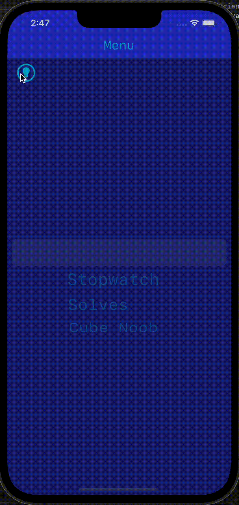
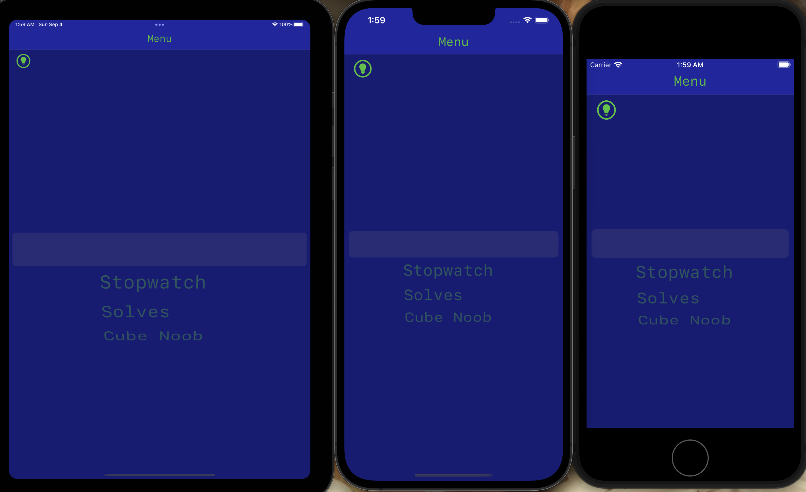
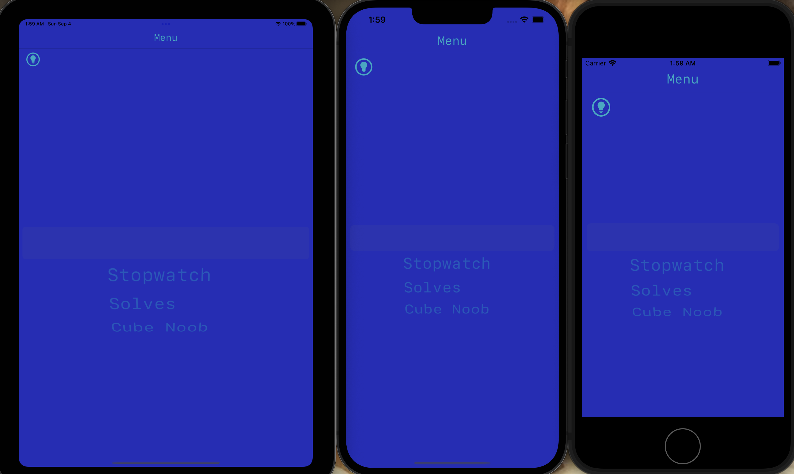
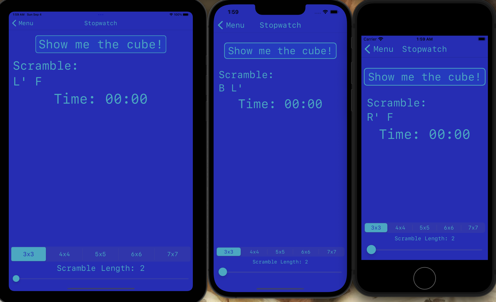
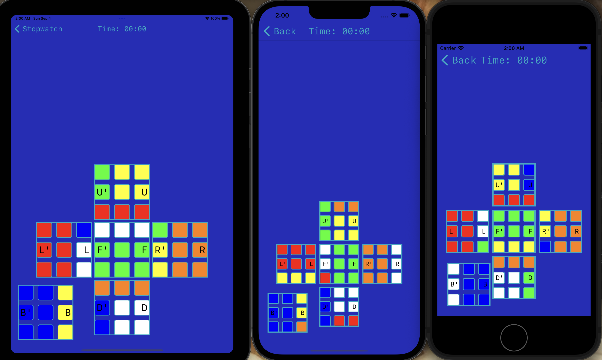
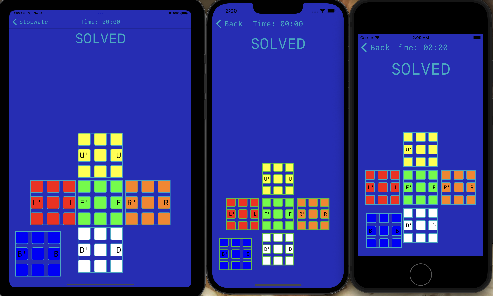
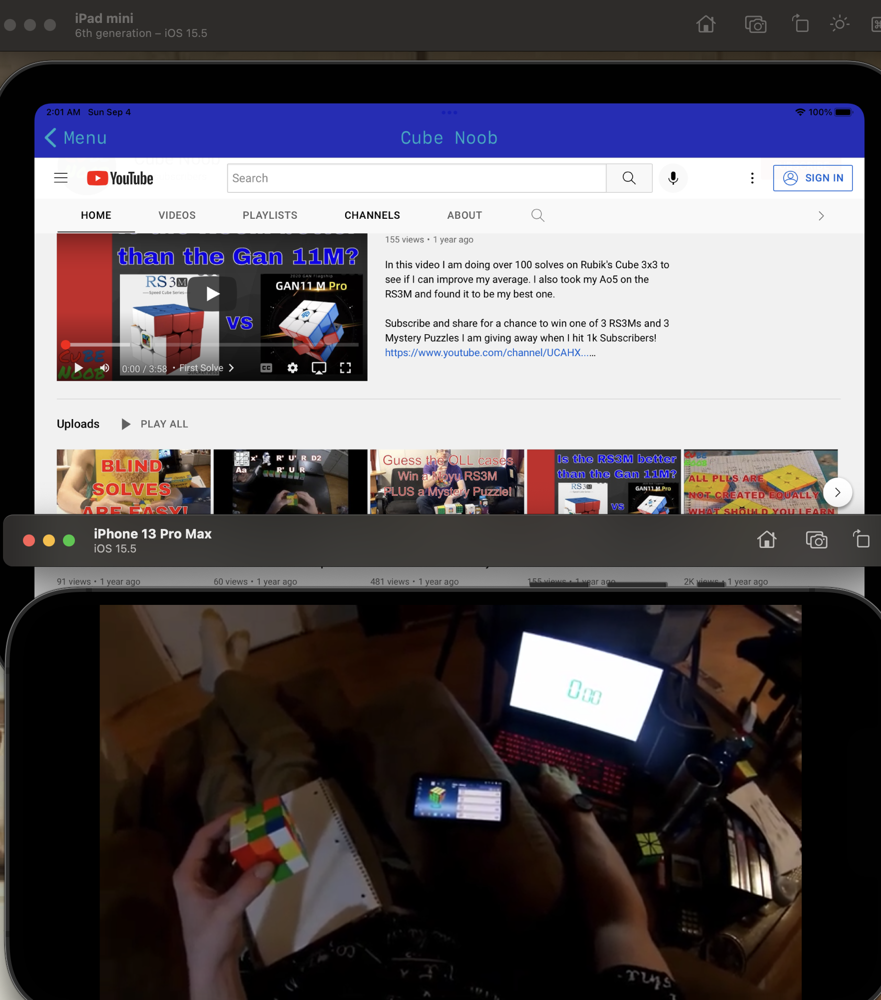

  <h1>CubeBuddyV2</h1>
  <h2>**NOW SUPPORTING MOST LANGUAGES**</h2>

 This is a rework of my original cube timer, which was made primarily with Storyboard IB. In this version which uses no storyboards at all, I use a custom Cube class(an extension of Kaz Yoshikawa's Cube class - /Models/Functional/CoreRubiksCube.swift). I added a function to map each face to a color in order to create a flat graphical representation of the cube which can be manipulated via buttons on the side of each face. I also added a function to convert a string to a move list and then return the mutated Cube object. Initially, I was storing solves in User Defaults to get up and running, but the application is now converted to use Core Data instead. In V1, I used Realm, but this made the application too heavy for regular size GitHub repos!

  
   

  
Dark Theme

  

  
Light Theme

  

