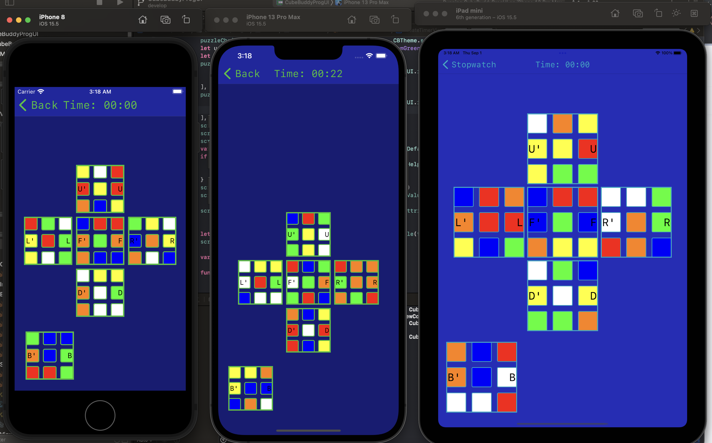

# CubeBuddyV2
Revamped with prog constraints

This is a rework of my original cube timer made primarily with Storyboard IB. In this version, I use a custom Cube data object(an extension of Kaz Yoshikawa's work) with each face mapped to a color in order to create a flat graphical representation of the cube which can be manipulated via 
buttons on the side of each face.

