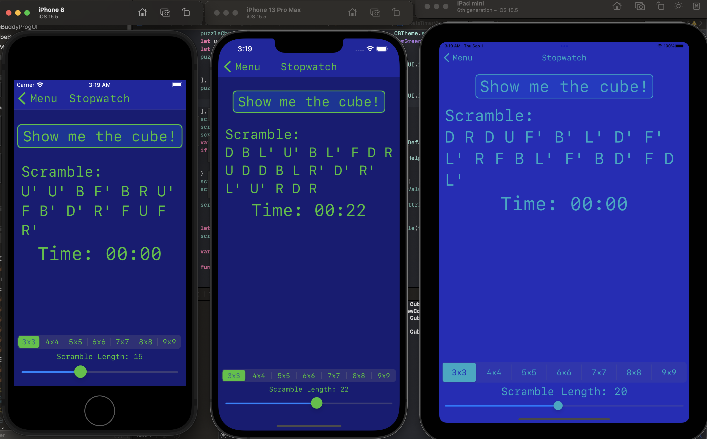
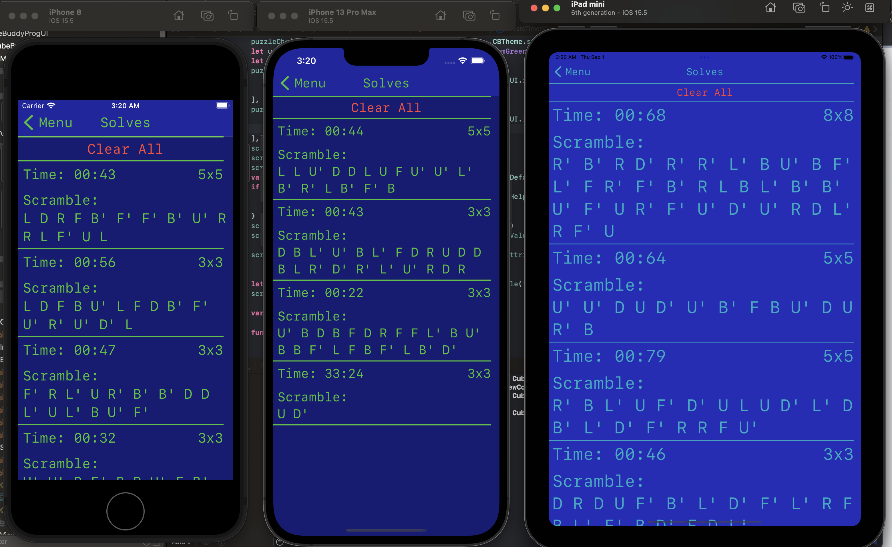

# CubeBuddyV2
Revamped with prog constraints

This is a rework of my original cube timer made primarily with Storyboard IB. In this version, I use a custom Cube data object(an extension of Kaz Yoshikawa's work) with each face mapped to a color in order to create a flat graphical representation of the cube which can be manipulated via 
buttons on the side of each face. 

* See iPad screenshots for example of light mode. Both iPhones pictured below are in dark mode.
* Cube sizes other than 3x3 are a work in progress. See the bottom-most pictures for current progress towards the UI creation.

